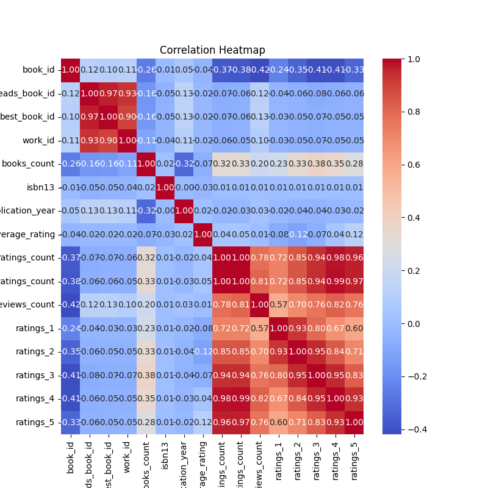
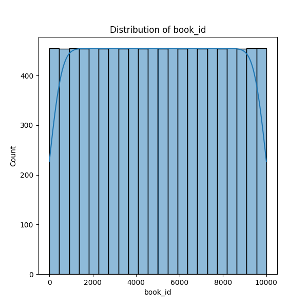
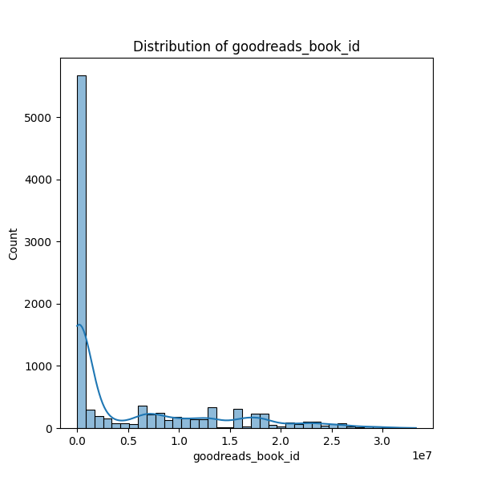

# Dataset Analysis Report

    | Column Name           | Data Type       |
    |-----------------------|-----------------|
      
| book_id                 | int64           |

| goodreads_book_id       | int64           |

| best_book_id            | int64           |

| work_id                 | int64           |

| books_count             | int64           |

| isbn                    | object          |

| isbn13                  | float64         |

| authors                 | object          |

| original_publication_year | float64         |

| original_title          | object          |

| title                   | object          |

| language_code           | object          |

| average_rating          | float64         |

| ratings_count           | int64           |

| work_ratings_count      | int64           |

| work_text_reviews_count | int64           |

| ratings_1               | int64           |

| ratings_2               | int64           |

| ratings_3               | int64           |

| ratings_4               | int64           |

| ratings_5               | int64           |

| image_url               | object          |

| small_image_url         | object          |

### Summary of the Dataset and Analysis

The dataset under analysis consists of 10,000 book entries, each identified by a unique `book_id` and containing various attributes that provide insight into their characteristics and reception. Among the key fields included are Goodreads identifiers, numerical ratings, author details, and publication information. 

Upon examination of the dataset, notable missing values were identified, particularly in the `isbn` and `isbn13` columns, which had 700 and 585 missing entries, respectively. The `original_publication_year` field also showed 21 missing values, while `original_title` was missing for 585 books. Additionally, the `language_code` field had the highest number of missing entries at 1,084. Despite these gaps, critical fields such as `average_rating`, `ratings_count`, and various rating breakdowns (ratings of 1 to 5) were complete, facilitating a robust analysis of the data.

Summary statistics indicate a diverse range of ratings and large variation in specific fields, such as `goodreads_book_id` and `work_id`. For instance, the `average_rating` may appear skewed since there’s a notable numerical distribution spread—indicating that while some books have received high acclaim, others have been rated significantly lower.

The correlation analysis revealed intriguing relationships. For example, `ratings_count` and `work_ratings_count` showed strong negative correlations with `book_id`, `books_count`, and several rating categories, suggesting that an increase in ratings did not necessarily correlate with typical measures of book quantity or ID. Conversely, the relatively weak correlation between `average_rating` and other variables suggests that the rating system may not always reflect the volume of reviews or ratings each book accumulates.

### Key Insights and Potential Implications

1. **Missing Values**: The substantial missing values in `isbn` and `isbn13` suggests potential issues with data integration or completeness that could affect any analysis requiring unique book identification. Addressing these could improve the dataset's usability.

2. **Correlation Trends**: The negative correlation between `ratings_count` and `work_text_reviews_count` against `average_rating` could imply that higher quantity of ratings does not translate to a conventional taste, thereby challenging the assumption that popularity is directly predictive of quality. 

3. **Publication Insights**: The `original_publication_year` could be pivotal in analyzing trends over time in book reception as it would allow for a temporal study of readership preferences. The missing values in this column suggest the need to emphasize verifying the publication date data to strengthen longitudinal analyses. 

### Suggestions for Further Analysis or Actions

1. **Imputation of Missing Data**: Utilize methods such as mean, mode, or more sophisticated techniques (like KNN imputation) to fill in gaps, particularly in `isbn`, `isbn13`, and `original_publication_year`.

2. **Detailed Trend Analysis**: Conduct a temporal analysis based on `original_publication_year` to identify any trends in ratings, authorship, or themes over the decades to understand shifting reader preferences.

3. **Sentiment Analysis on Reviews**: Since the dataset contains counts of text reviews, further analysis through sentiment analysis of these reviews could uncover deeper insights into consumer sentiment towards each book and what aspects lead to high or low ratings.

4. **Visual Analysis**: Enhance visualizations of the findings, particularly concerning the distribution of `average_rating` against various rating counts. This visual representation can help to identify outliers and better communicate results.

5. **Exploration of Author Influence**: Analyzing the impact of `authors` on ratings could unveil which authors consistently receive high ratings and whether certain genres dominate over others within this dataset or others.

By conducting further investigative analyses and addressing gaps in data, we can generate actionable insights that influence marketing strategies, recommendation systems, and could fuel targeted promotional activities based on author popularity or book themes.

## Visualizations
### correlation_heatmap.png

### book_id_distribution.png

### goodreads_book_id_distribution.png

