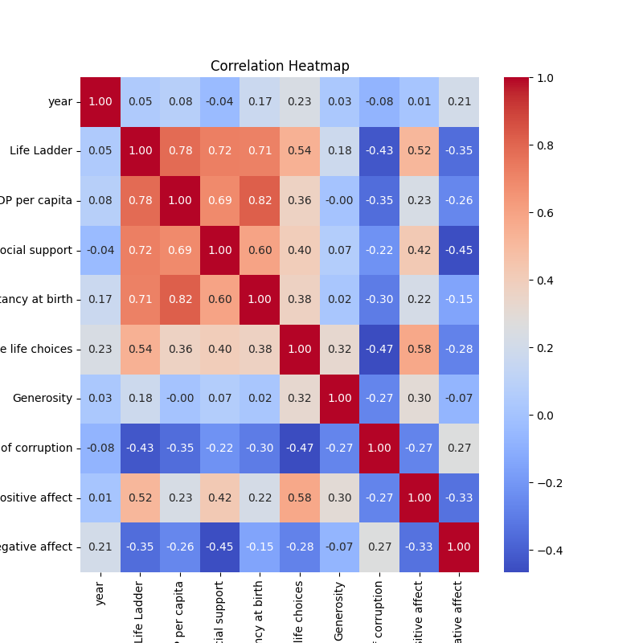
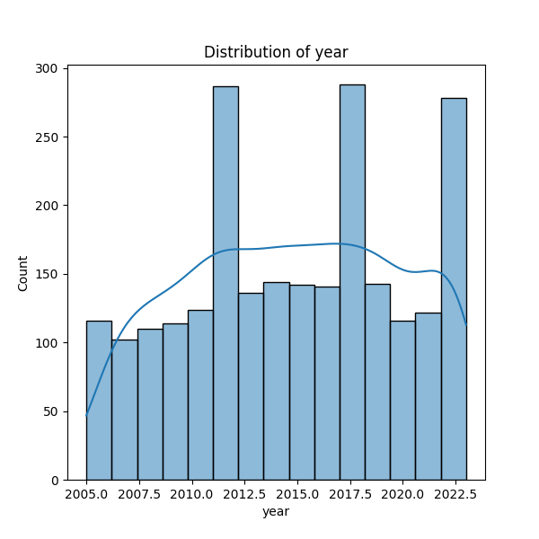
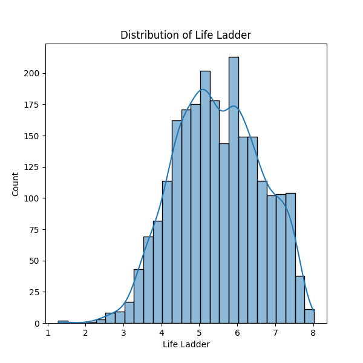

# Dataset Analysis Report

    | Column Name           | Data Type       |
    |-----------------------|-----------------|
      
| Country name            | object          |

| year                    | int64           |

| Life Ladder             | float64         |

| Log GDP per capita      | float64         |

| Social support          | float64         |

| Healthy life expectancy at birth | float64         |

| Freedom to make life choices | float64         |

| Generosity              | float64         |

| Perceptions of corruption | float64         |

| Positive affect         | float64         |

| Negative affect         | float64         |

### Dataset Summary and Analysis Narrative

The analysis centers on a dataset comprising quality of life indicators across various countries collected from 2005 to 2023. The dataset is structured around significant variables, including ‘Life Ladder,’ ’Log GDP per capita,’ ‘Social support,’ ‘Healthy life expectancy at birth,’ ‘Freedom to make life choices,’ ‘Generosity,’ ‘Perceptions of corruption,’ ‘Positive affect,’ and ‘Negative affect.’ 

In total, there are 2,363 entries representing 165 unique countries. Notably, Lebanon appears with the highest frequency in the dataset (18 occurrences). The years represented range from 2005 to 2023, with an average year of approximately 2014, indicating a longitudinal study of well-being and socio-economic factors.

However, the dataset has missing values in several crucial quantitative measures, most prominently in 'Generosity,' which has a staggering 81 missing entries (approximately 3.4% of the dataset), and 'Perceptions of corruption,' with 125 missing values (about 5.3%). This indicates that while data was collected consistently across many indicators, certain measures were less comprehensively recorded. 

The analysis revealed varied averages for each indicator—e.g., the average Life Ladder score is approximately 5.48 —which suggests a moderate level of well-being across the surveyed populations. The 'Healthy life expectancy at birth' variable, for instance, has greater representation in its data, which could provide useful implications for health-related policies if correlated with other social indicators.

The correlation analysis highlights important relationships between the different variables. Notably, the ‘Life Ladder’ (conceptualized as subjective well-being) shows a positive correlation with ‘Healthy life expectancy at birth’ (0.17) and a stronger relationship with ‘Freedom to make life choices’ (0.23). Conversely, there is a notable negative correlation between 'Negative affect' and ‘Life Ladder’ (-0.21), suggesting that higher levels of reported negative emotions may correlate with lower subjective well-being. 

### Key Insights and Potential Implications

1. **Economic Perception vs. Life Quality**: Despite the positive correlation with log GDP per capita, the relationship is weak (0.08), suggesting that economic indicators alone might not provide a comprehensive understanding of well-being. Policy-makers should consider integrating social and psychological factors along with economic growth in their assessments.

2. **Well-being and Health**: The positive correlation between ‘Healthy life expectancy at birth’ and ‘Life Ladder’ emphasizes the need for a focus on health policies. Improving health conditions can have a significantly more beneficial impact on subjective well-being than solely economic measures.

3. **Emotional Factors**: The significant association between ‘Negative affect’ and lower well-being prompts an examination of social and psychological services in countries showing high negative affect scores. Addressing mental health could improve overall life satisfaction.

4. **Freedom and Well-being**: Countries that score higher on ‘Freedom to make life choices’ also report higher life satisfaction. This indicates that policies promoting personal autonomy may lead to better social outcomes.

### Further Analyses and Actions

1. **Filling Missing Values**: As various indicators have missing data, it would be worthwhile to explore imputation methods to fill in these gaps for a more robust analysis. Understanding the patterns of missing data could yield insights into the dataset’s integrity.

2. **Geographical Analysis**: Conduct geographical clustering to assess regional trends in well-being and socio-economic factors; this could reveal spatial inequality and help tailor regional policies.

3. **Longitudinal Studies**: Investigate trends over time within countries to understand how changes in specific indicators relate to shifts in the ‘Life Ladder.’ This will allow for a better understanding of causal relationships over the long term.

4. **Subgroup Analysis**: Explore intersections between demographic factors (age, gender, etc.) and well-being indicators, gaining insights into specific population needs and tailoring interventions accordingly.

By pursuing these further analyses and actions, significant strides can be made towards understanding the multifaceted nature of life quality and the factors influencing it across different socio-economic landscapes.

## Visualizations
### correlation_heatmap.png

### year_distribution.png

### Life Ladder_distribution.png

