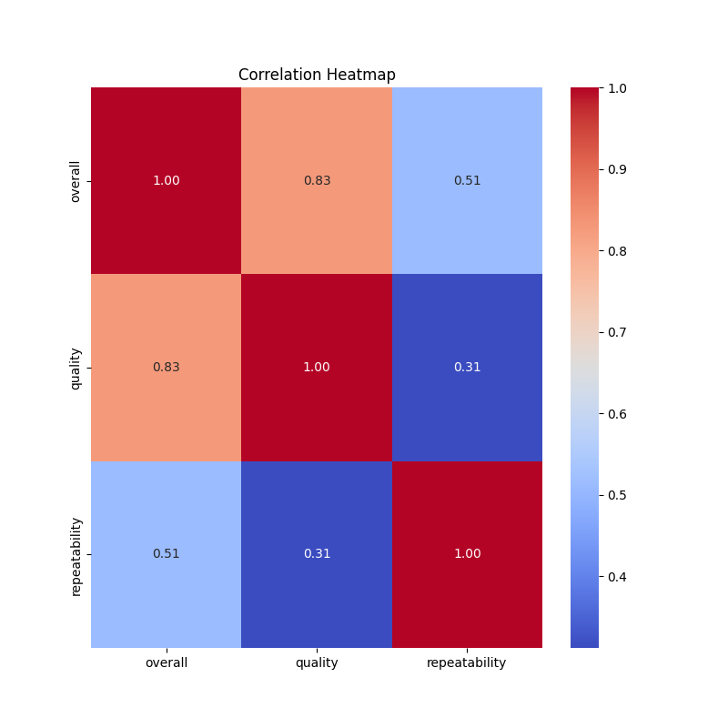
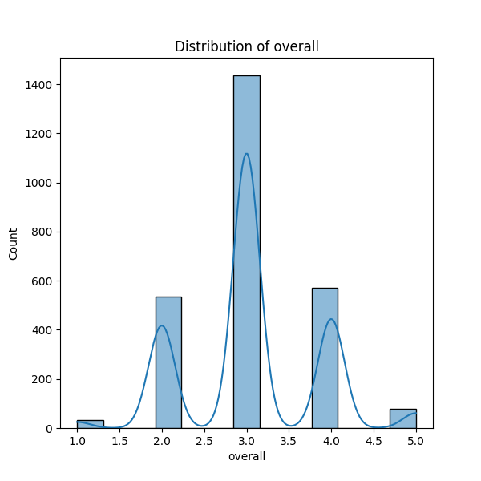
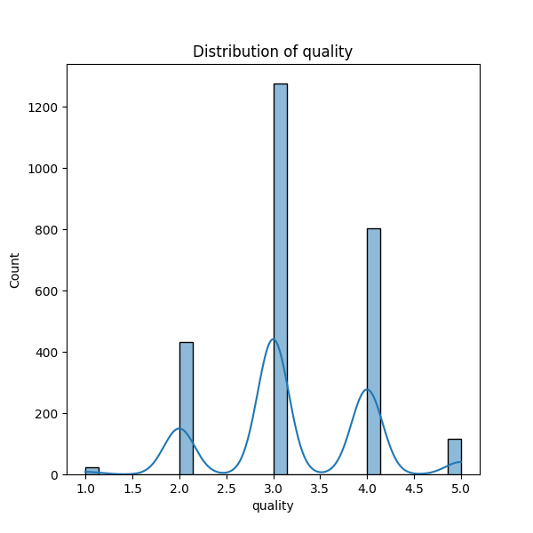

# Dataset Analysis Report

    | Column Name           | Data Type       |
    |-----------------------|-----------------|
      
| date                    | object          |

| language                | object          |

| type                    | object          |

| title                   | object          |

| by                      | object          |

| overall                 | int64           |

| quality                 | int64           |

| repeatability           | int64           |

### Dataset Summary and Analysis Narrative

The dataset under review comprises 2,652 entries with several important features across various columns, including 'date', 'language', 'type', 'title', 'by', 'overall', 'quality', and 'repeatability'. Due to the richness of the dataset, it offers a multifaceted view of the data being analyzed. However, it is important to note that there are some missing values, particularly with the 'date' and 'by' columns. The 'date' column has 99 missing entries, while the 'by' column is missing 262 values.

Upon examination, the data reflects diversity in terms of language and type. The top language is English, found in 1,306 instances, and the predominant type is 'movie', which appears in 2,211 records. The wealth of unique entries—specifically, 2,055 unique dates—suggests a varied timeline of events or records.

In terms of overall performance metrics, three key variables—'overall', 'quality', and 'repeatability'—show interesting relationships. Correlation analysis reveals that the 'overall' score is strongly correlated with 'quality' (correlation coefficient of 0.826). This indicates that as quality improves, the overall rating also significantly increases. In contrast, 'repeatability' is moderately correlated with 'overall' (0.513) and has a lower correlation with 'quality' (0.312). This suggests that while repeatability positively influences overall assessments, it has less impact on perceived quality.

### Key Insights and Implications

1. **Language Preference**: The dominance of English in the dataset may indicate that this dataset largely pertains to English-speaking regions or markets. Marketers and content creators should consider tailoring their strategies to complement this dominant language preference while exploring opportunities in underrepresented languages.

2. **Content Type Analysis**: The preponderance of 'movies' points to a significant market segment. This suggests an emphasis on video content which could have implications for stakeholders looking into diversifying offerings or engaging new audiences through various media types.

3. **Quality as a Driver of Overall Satisfaction**: The strong correlation between overall ratings and quality suggests that improving one will likely positively affect the other. For businesses or organizations, ensuring high quality in content will be critical to enhancing overall user satisfaction.

4. **Need for Refinement in Metrics**: The relatively low correlation between repeatability and quality implies that repeatability may not serve as a strong indicator of quality. Stakeholders might consider developing clearer metrics to evaluate content quality that transcends mere repeatability for a more holistic assessment.

### Suggested Further Analyses or Actions

1. **Data Imputation for Missing Values**: It’s essential to address the missing values, especially in 'date' and 'by'. Implementing data imputation techniques or analyzing patterns in the missing data could provide a more comprehensive view. This step would improve the robustness of any subsequent analyses or modeling.

2. **Temporal Analysis**: Since 'date' is a key variable, a temporal analysis could provide insights into trends over time. Exploring how 'overall', 'quality', and 'repeatability' scores change over specific periods could unlock revealing patterns.

3. **Segmentation Analysis**: Conducting further segmentation analysis based on language and type could yield targeted insights. Understanding how different demographics engage with content across varying languages and types could refine marketing strategies.

4. **Enhanced Quality Measurement**: A detailed analysis into the factors influencing the quality rating could be beneficial. Including additional metrics that account for user engagement or feedback could enhance the understanding of what drives quality perception.

5. **Deep Dive into Repeatability**: Investigating the characteristics of repeatability and how it interacts with both 'quality' and 'overall' could elucidate opportunities for improving content or experiences that encourage repeat engagement.

By addressing these areas, we can make better-informed decisions based on the dataset, optimizing strategies for content engagement and user satisfaction while identifying opportunities for growth in underrepresented areas.

## Visualizations
### correlation_heatmap.png

### overall_distribution.png

### quality_distribution.png

